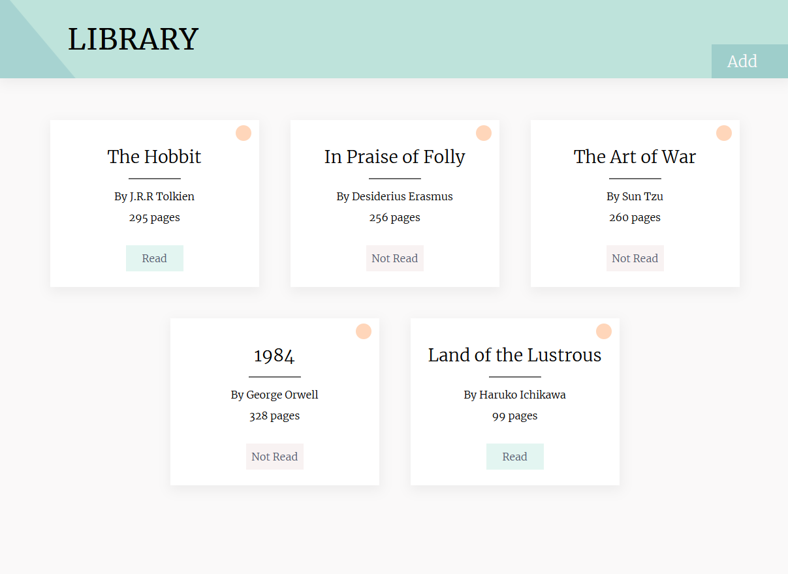

# library

### Featuring mobile-support and local storage.

A neat little library project for [TOP](https://www.theodinproject.com/)!
This project was mainly focused on using objects in JavaScript.

My main ( personal ) objectives in this task were to refine my planning and pseudocode skills.
To accomplish this, I created a design via the use of Figma and drew diagrams for this project.

## Learning Outcomes

- Use JS objects and object constructors to organize code
- Retrieving and using form data
- Reading and writing to / from local storage
- Create a functional UI / UX

### Credits

Google Fonts for the <a href="https://fonts.google.com/specimen/Merriweather">Merriweather</a> font.
